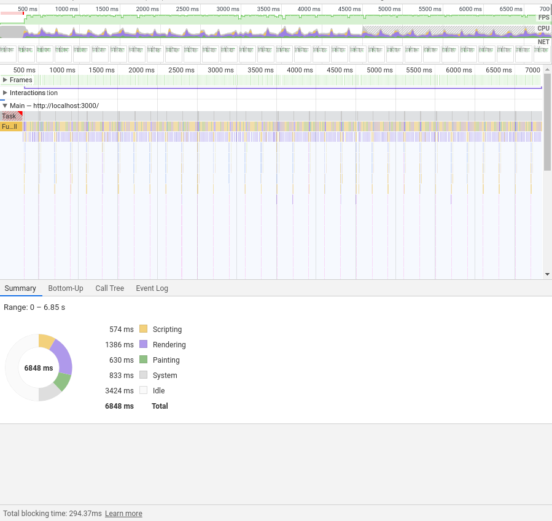

# WebSocket performance demo

An example of the load websockets can handle.

The code is very basic. The aim is to test the performance of WebSockets pushing data very
frequently to a web application and the application updating in real time.

## Scenario

The demonstrated scenario consists of [a backend server](./backend/node) and [a frontend web client](./frontend).

After connecting from the web app to the backend via a WebSocket, the backend server starts pushing
messages in the shape of

```json
{
  "row": 2,
  "column": 8,
  "value": 20
}
```

to the client. The frontend throttles all the updates and applies them on the screen every 100ms
(configurable by `TABLE_REFRESH_INTERVAL`).

The application also shows the number of received messages, and computes the average messages
received per second and per minute.

## Results

The browser handled 18k messages per minute without any problem. The UI was responsive.




The performance tab shows that there was little processing time. Most of the time during each frame
was spent on rendering and painting (1386ms and 630ms, respectively, around 30% in total), compared
to only 574ms (8%) spent in JavaScript, processing each message. The browser spent 50% of the time
idle.

| Task type | Time spent (ms) | Percentage time spent |
| --------- | --------------- | --------------------- |
| Scripting | 574             | 8%                    |
| Rendering | 1386            | 20%                   |
| Painting  | 630             | 9%                    |
| System    | 833             | 13%                   |
| Idle      | 3424            | 50%                   |
| Total     | 6848            | 100%                  |

## Running the demo

After pulling the repository, do the following:

```sh
cd backend/node
npm install
npm start
```

and go to <http://localhost:3000>

## Configuration

### Backend

1. `PORT` environment variable - the variable that the backend will bind to
2. `MESSAGES_PER_MINUTE` (in `index.js`)

### Frontend

1. `tableSize` (the number of rows and columns)
2. `TABLE_REFRESH_INTERVAL`
3. `STATUS_REFRESH_INTERVAL`
